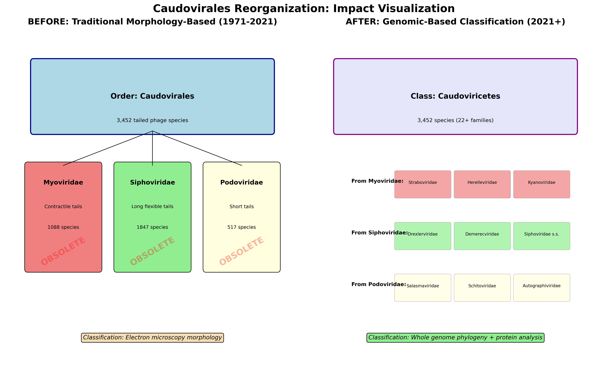
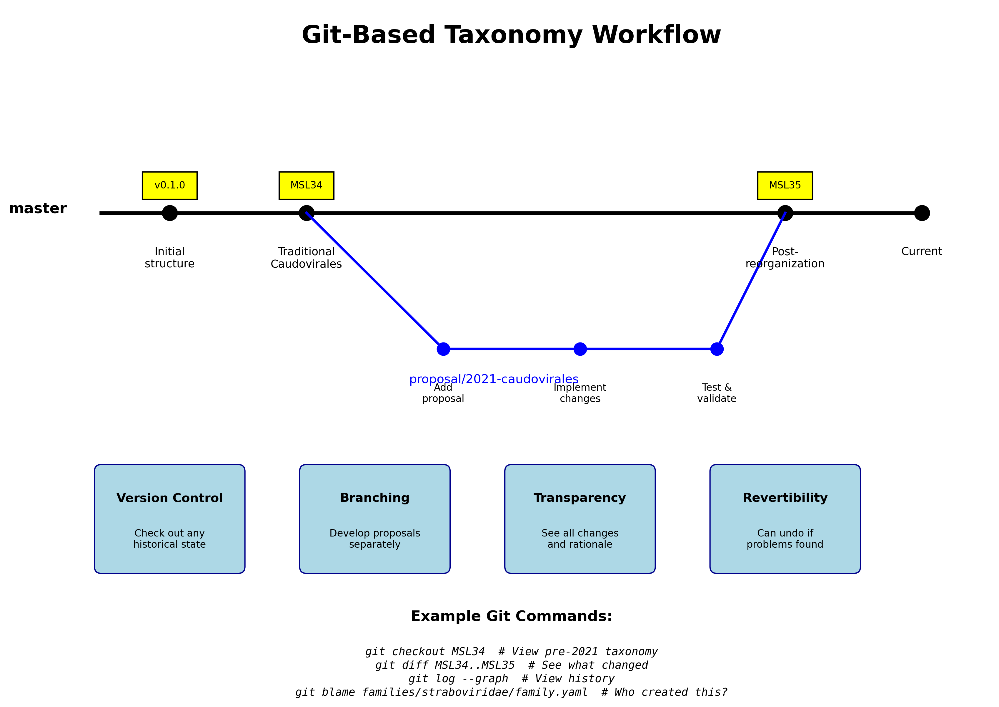
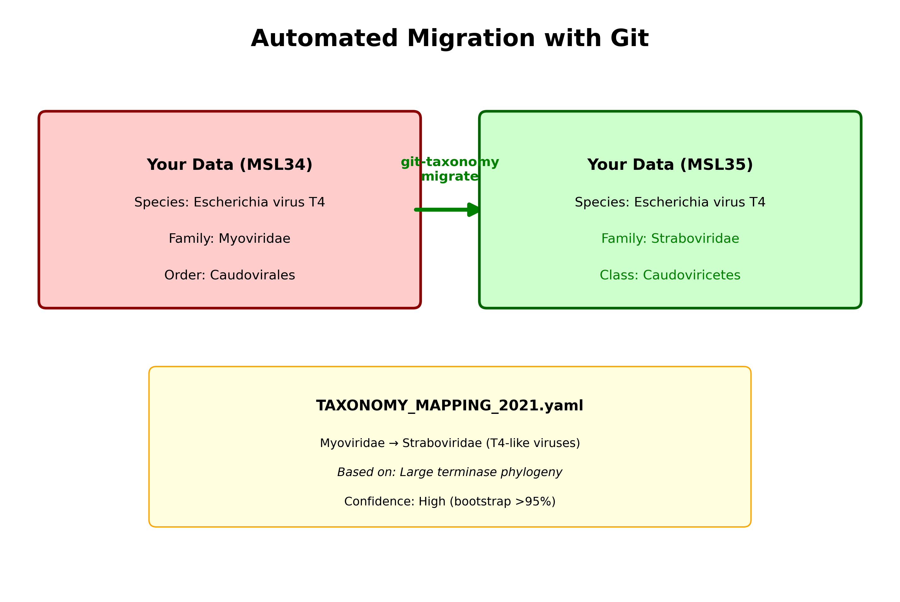

# Git-Based Taxonomy Demonstration: Caudovirales Case Study

## Overview

This demonstration shows how git version control could revolutionize viral taxonomy management, using the 2021 Caudovirales reorganization as a real-world example.

## The Problem: Caudovirales Reorganization (2021)

The most significant reorganization in ICTV history:
- **3,452 species** affected
- **3 families abolished** (Myoviridae, Siphoviridae, Podoviridae)
- **22+ new families created**
- **50 years of morphology-based classification** overturned

### Impact on Researchers
- Papers published before/after use incompatible taxonomies
- No clear migration path for existing datasets
- Lost associations with decades of ecological data
- Database inconsistencies across platforms

## The Git Solution

### 1. Complete History Preservation

```bash
# View the complete history
git log --oneline --graph --all

* 35a8103 Add case study documentation
*   68e83e8 Merge proposal/2021-caudovirales-abolishment
|\  
| * 9aaafcf Implement Caudovirales abolishment (Proposal 2021.001B)
| * 006291a Add proposal 2021.001B for Caudovirales abolishment
|/  
* 5bf12fb Establish traditional Caudovirales taxonomy (1971-2021)
* 23814b4 Initial repository structure
```

### 2. Tagged Releases for Reproducibility

```bash
# Work with any historical version
git checkout MSL34  # Pre-reorganization state
git checkout MSL35  # Post-reorganization state
```

### 3. Clear Migration Paths

The `TAXONOMY_MAPPING_2021.yaml` file provides explicit mappings:

```yaml
mappings:
  Myoviridae:
    new_families:
    - Straboviridae     # T4-like viruses
    - Herelleviridae    # SPO1-like viruses
    - Kyanoviridae      # P2-like viruses
    species_redistribution: Based on large terminase phylogeny
```

### 4. Transparent Decision Process

Every change includes:
- Rationale in commit messages
- Links to proposal documents
- Evidence files (phylogenetic trees, etc.)
- Committee approval records

## Key Demonstrations

### Before/After Visualization


Shows the dramatic shift from 3 morphology-based families to 22+ genome-based families.

### Git Workflow Benefits


Illustrates how proposals can be developed in branches, reviewed, and merged with full transparency.

### Automated Migration


Demonstrates how researchers can automatically update their datasets between taxonomy versions.

## Repository Structure

```
caudovirales_git_demo/
├── .git/                    # Git version control
├── families/                # Family definitions
│   ├── myoviridae/         
│   │   ├── family.yaml      # Original definition
│   │   ├── OBSOLETE.yaml    # Marked obsolete in 2021
│   │   └── species/         # Example species
│   ├── straboviridae/       # New family (2021)
│   └── ...                  # Other families
├── orders/                  # Taxonomic orders
├── classes/                 # Taxonomic classes
│   └── caudoviricetes/      # New class replacing Caudovirales
├── proposals/               # ICTV proposals
│   └── 2021/
│       └── 2021.001B_caudovirales_abolishment.md
├── evidence/                # Supporting data
└── TAXONOMY_MAPPING_2021.yaml  # Migration mappings
```

## Git Commands for Exploration

```bash
# See what changed in the reorganization
git diff MSL34..MSL35

# View specific file history
git log --follow families/myoviridae/family.yaml

# See who made changes and when
git blame TAXONOMY_MAPPING_2021.yaml

# Explore alternative proposals
git branch -a

# Revert if needed (with new commit)
git revert <commit-hash>
```

## Benefits for ICTV

1. **Version Control**: Every change tracked with full context
2. **Branching**: Proposals developed independently
3. **Transparency**: Community can see all decisions
4. **Reproducibility**: Any version accessible forever
5. **Automation**: Migration tools prevent errors
6. **Collaboration**: Multiple proposals can coexist

## Implementation Path

1. **Convert historical MSLs** to git repository
2. **Create migration tools** for existing databases
3. **Develop web interface** for browsing
4. **Build API** for programmatic access
5. **Community adoption** through benefits demonstration

## Conclusion

Git-based taxonomy would have made the Caudovirales reorganization:
- **Transparent**: Clear rationale and evidence
- **Manageable**: Automated migration paths
- **Reversible**: Could undo if issues found
- **Collaborative**: Community input possible

This demonstration uses real ICTV data to show how version control can transform scientific data management.

---

*Generated from actual ICTV Master Species List data and 2021 reorganization documentation*